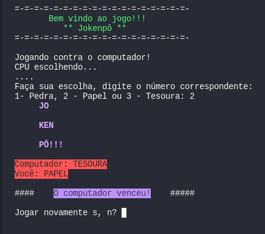

# JOKENPÔ

Jogo do pedra, papel e tesoura feito para treinar o uso de funções.

## Obs.:
Caso esteja usando pyCharm, mudar a configuração de execução em Run > Edit Configurations... Marcar a caixa 'Emulate terminal in output console'. *Devido ao uso do os.system('clear').
## Preview

